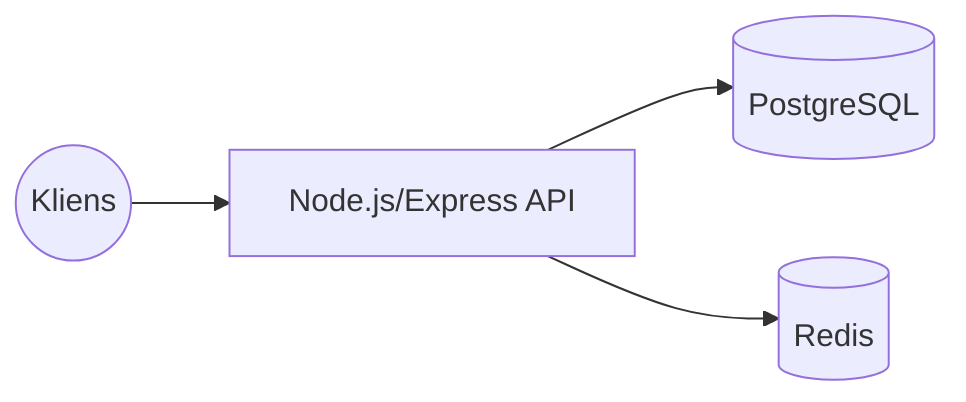
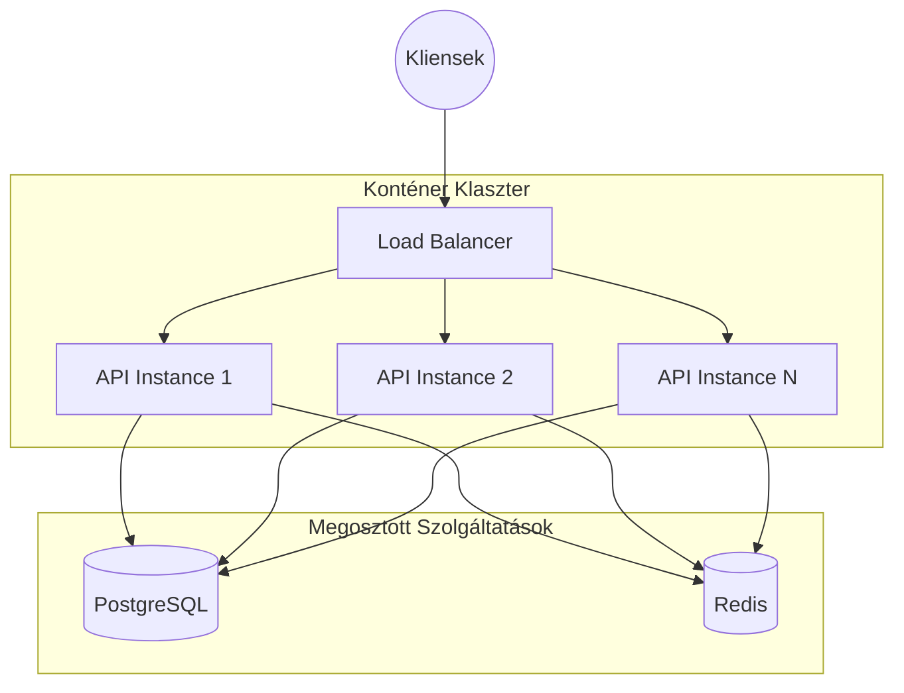
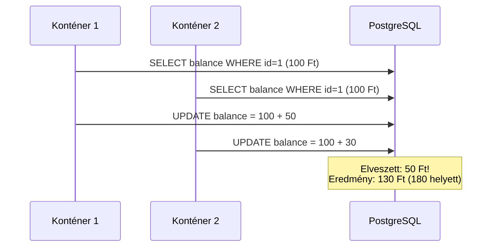
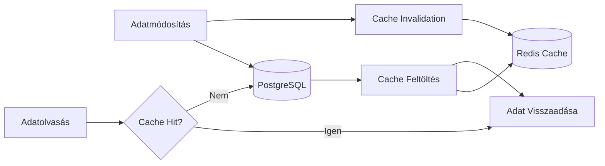

# 🔄 Konkurencia Kezelési Terv - Konténerizált Backend és Load Balancer

> **Dokumentum célja**: Terv a backend konténerizálásához és load balancer mögötti konkurens interakciók kezeléséhez.  
> **Utolsó frissítés**: 2026-02-03

---

## 📋 Tartalom

1. [Probléma Áttekintése](#-1-probléma-áttekintése)
2. [Architektúra Célkitűzések](#-2-architektúra-célkitűzések)
3. [Konkurencia Problémák Típusai](#-3-konkurencia-problémák-típusai)
4. [Megoldási Stratégiák](#-4-megoldási-stratégiák)
5. [Adatbázis Szintű Konkurencia](#-5-adatbázis-szintű-konkurencia)
6. [Session és JWT Kezelés](#-6-session-és-jwt-kezelés)
7. [Elosztott Queue és Háttérfolyamatok](#-7-elosztott-queue-és-háttérfolyamatok)
8. [Rate Limiting Elosztott Környezetben](#-8-rate-limiting-elosztott-környezetben)
9. [Cache Stratégia](#-9-cache-stratégia)
10. [Implementációs Checklist](#-10-implementációs-checklist)

---

## 🎯 1. Probléma Áttekintése

### Jelenlegi Architektúra (Single Instance)


### Célzott Architektúra (Multi-Instance + Load Balancer)


### Fő Kihívások

| Probléma | Leírás | Súlyosság |
|:---------|:-------|:----------|
| Race Condition | Ugyanaz az erőforrás egyidejű módosítása | 🔴 Kritikus |
| Lost Updates | Frissítések elvesztése párhuzamos írás esetén | 🔴 Kritikus |
| Session Affinity | JWT token konzisztencia konténerek között | 🟡 Közepes |
| Rate Limiting | In-memory rate limit nem működik elosztottan | 🟡 Közepes |
| Background Jobs | Duplikált job végrehajtás | 🟡 Közepes |
| Cache Invalidation | Inkonzisztens cache állapot | 🟡 Közepes |

---

## 🎯 2. Architektúra Célkitűzések

### Alapelvek

1. **Stateless API Design** - Minden konténer azonos funkcionalitással rendelkezik, állapot nélkül
2. **Shared State External Storage** - Minden megosztott állapot Redis-ben vagy PostgreSQL-ben
3. **Idempotens Műveletek** - Ugyanaz a request többször végrehajtva azonos eredményt ad
4. **Optimista vs Pesszimista Lock** - Megfelelő stratégia választása művelet típusa alapján

---

## 🔍 3. Konkurencia Problémák Típusai

### 3.1 Read-Write Konfliktusok



### 3.2 Write-Write Konfliktusok

Példa a projektből:
- Két cégadmin egyszerre módosítja ugyanazt a pozíciót
- Két felhasználó egyszerre jelentkezik ugyanarra az utolsó pozícióra
- Partnership státusz egyidejű frissítése

### 3.3 Phantom Reads

- Egy tranzakció alatt új rekordok jelennek meg/tűnnek el
- Statisztikai lekérdezéseknél inkonzisztencia

---

## 💡 4. Megoldási Stratégiák

### 4.1 Optimista Konkurencia Control (OCC)

**Mikor használjuk**: Alacsony konfliktus valószínűség, olvasás-intenzív műveletek

```typescript
// Prisma model kiegészítése
model Position {
  id        String   @id @default(uuid())
  version   Int      @default(1)  // 👈 Verzió mező
  // ... többi mező
  updatedAt DateTime @updatedAt
}

// Service implementáció
async function updatePosition(id: string, data: UpdatePositionDto, expectedVersion: number) {
  const result = await prisma.position.updateMany({
    where: { 
      id, 
      version: expectedVersion  // 👈 Csak ha a verzió egyezik
    },
    data: { 
      ...data, 
      version: { increment: 1 }  // 👈 Verzió növelése
    }
  });
  
  if (result.count === 0) {
    throw new ConflictError('CONCURRENT_MODIFICATION', 
      'Az erőforrás módosult. Kérjük, frissítse az oldalt és próbálja újra.');
  }
}
```

### 4.2 Pesszimista Konkurencia Control (Lock)

**Mikor használjuk**: Magas konfliktus valószínűség, kritikus adatok

```typescript
// Adatbázis szintű zár (FOR UPDATE)
async function processApplication(applicationId: string) {
  return await prisma.$transaction(async (tx) => {
    // Zárolás a tranzakció idejére
    const application = await tx.$queryRaw`
      SELECT * FROM "Application" 
      WHERE id = ${applicationId} 
      FOR UPDATE
    `;
    
    // Biztonságos modifikáció
    return await tx.application.update({
      where: { id: applicationId },
      data: { status: 'PROCESSING' }
    });
  });
}
```

### 4.3 Elosztott Lock (Redis)

**Mikor használjuk**: Konténerek közötti koordináció

```typescript
// Redlock implementáció
import Redlock from 'redlock';
import Redis from 'ioredis';

const redis = new Redis(process.env.REDIS_URL);
const redlock = new Redlock([redis], {
  retryCount: 3,
  retryDelay: 200,
  automaticExtensionThreshold: 500
});

async function safelyUpdatePartnership(partnershipId: string, data: UpdateDto) {
  const lockKey = `lock:partnership:${partnershipId}`;
  
  const lock = await redlock.acquire([lockKey], 5000); // 5 sec lock
  try {
    // Kritikus szekció
    const result = await partnershipService.update(partnershipId, data);
    return result;
  } finally {
    await lock.release();
  }
}
```

---

## 🗄️ 5. Adatbázis Szintű Konkurencia

### 5.1 PostgreSQL Izolációs Szintek

| Szint | Dirty Read | Non-Repeat Read | Phantom | Ajánlott Használat |
|:------|:-----------|:----------------|:--------|:-------------------|
| READ UNCOMMITTED | Lehetséges | Lehetséges | Lehetséges | ❌ Nem használjuk |
| READ COMMITTED | Nem | Lehetséges | Lehetséges | ✅ Alapértelmezett |
| REPEATABLE READ | Nem | Nem | Lehetséges | ✅ Pénzügyi műveletek |
| SERIALIZABLE | Nem | Nem | Nem | ⚠️ Kritikus esetekben |

### 5.2 Tranzakciós Izoláció Beállítása (Prisma)

```typescript
// Kritikus tranzakciónál
await prisma.$transaction(
  async (tx) => {
    // ... műveletek
  },
  {
    isolationLevel: Prisma.TransactionIsolationLevel.Serializable,
    maxWait: 5000,
    timeout: 10000
  }
);
```

### 5.3 Unique Constraint Védelem

```prisma
// Már meglévő - ez megakadályozza a duplikált jelentkezéseket
model Application {
  id         String @id @default(uuid())
  studentId  String
  positionId String
  
  @@unique([studentId, positionId])  // 👈 Duplikáció védelem
}
```

### 5.4 Adatbázis Advisory Locks

```typescript
// PostgreSQL advisory lock
async function exclusiveOperation(key: number) {
  await prisma.$executeRaw`SELECT pg_advisory_lock(${key})`;
  try {
    // Kritikus szekció
  } finally {
    await prisma.$executeRaw`SELECT pg_advisory_unlock(${key})`;
  }
}
```

---

## 🔐 6. Session és JWT Kezelés

### 6.1 JWT Állapotmentesség

A jelenlegi JWT implementáció **natívan támogatja** a multi-instance környezetet, mivel:
- A token validáláshoz csak a `JWT_SECRET` szükséges
- Nincs server-side session tárolás

### 6.2 Token Blacklist (Logout)

> [!IMPORTANT]
> A logout funkció token blacklist-et igényel, amit Redis-ben kell tárolni!

```typescript
// Redis alapú token blacklist
class TokenBlacklistService {
  private redis: Redis;
  
  async blacklistToken(token: string, expiresAt: Date): Promise<void> {
    const ttl = Math.ceil((expiresAt.getTime() - Date.now()) / 1000);
    await this.redis.setex(`blacklist:${token}`, ttl, '1');
  }
  
  async isBlacklisted(token: string): Promise<boolean> {
    const result = await this.redis.get(`blacklist:${token}`);
    return result === '1';
  }
}

// Auth middleware kiegészítése
async function authenticate(req, res, next) {
  const token = extractToken(req);
  
  // Blacklist ellenőrzés
  if (await tokenBlacklistService.isBlacklisted(token)) {
    throw new UnauthorizedError('TOKEN_REVOKED');
  }
  
  // ... többi validáció
}
```

---

## ⚙️ 7. Elosztott Queue és Háttérfolyamatok

### 7.1 BullMQ Már Elosztott

A jelenlegi BullMQ implementáció **automatikusan képes** több worker kezelésére:

```typescript
// Már létező config (src/config/bullmq.config.ts)
// A Redis alapú queue garantálja:
// - Egy job csak egy worker-en fut
// - Failed job-ok retry
// - Completed job history
```

### 7.2 Job Idempotencia

```typescript
// Idempotens job ID használata
async function queueEmailJob(userId: string, type: string) {
  const jobId = `email:${type}:${userId}:${Date.now()}`;
  
  await emailQueue.add('send-email', 
    { userId, type },
    { 
      jobId,  // Egyedi azonosító
      removeOnComplete: true,
      removeOnFail: 100
    }
  );
}
```

### 7.3 Job Deduplication

```typescript
// Duplikált job elkerülése
await emailQueue.add('send-email', data, {
  jobId: `unique-key-${data.userId}`,
  removeOnComplete: true,
  // Ha már létezik ilyen jobId, nem adja hozzá újra
});
```

---

## 🚦 8. Rate Limiting Elosztott Környezetben

### 8.1 Probléma

A jelenlegi in-memory rate limiting **NEM működik** load balancer mögött:

```
Kliens → LB → Instance 1 (limit: 100/perc) ← Hibás!
            → Instance 2 (limit: 100/perc) ← Hibás!
```

Eredmény: A felhasználó 200 request-et küldhet percenként!

### 8.2 Megoldás: Redis Rate Limiter

```typescript
import rateLimit from 'express-rate-limit';
import RedisStore from 'rate-limit-redis';

const limiter = rateLimit({
  store: new RedisStore({
    // @ts-expect-error - Known issue with types
    sendCommand: async (...args) => redis.call(...args),
    prefix: 'rl:'
  }),
  windowMs: 60 * 1000, // 1 perc
  max: 100,
  standardHeaders: true,
  legacyHeaders: false,
  message: {
    success: false,
    error: {
      code: 'RATE_LIMIT_EXCEEDED',
      message: 'Túl sok kérés. Próbálja újra később.'
    }
  }
});

// Alkalmazás
app.use('/api/', limiter);
```

### 8.3 Sliding Window Implementáció

```typescript
// Pontosabb rate limiting sliding window-val
import { RateLimiterRedis } from 'rate-limiter-flexible';

const rateLimiter = new RateLimiterRedis({
  storeClient: redis,
  keyPrefix: 'ratelimit',
  points: 100,        // requests
  duration: 60,       // per 60 seconds
  blockDuration: 60,  // block for 60s if exceeded
});

async function rateLimitMiddleware(req, res, next) {
  try {
    const key = req.user?.id || req.ip;
    await rateLimiter.consume(key);
    next();
  } catch (rateLimiterRes) {
    res.status(429).json({
      success: false,
      error: {
        code: 'RATE_LIMIT_EXCEEDED',
        message: 'Túl sok kérés',
        retryAfter: Math.ceil(rateLimiterRes.msBeforeNext / 1000)
      }
    });
  }
}
```

---

## 💾 9. Cache Stratégia

### 9.1 Redis Cache Réteg

```typescript
class CacheService {
  private redis: Redis;
  private prefix = 'cache:';
  
  async get<T>(key: string): Promise<T | null> {
    const data = await this.redis.get(this.prefix + key);
    return data ? JSON.parse(data) : null;
  }
  
  async set(key: string, value: unknown, ttlSeconds = 300): Promise<void> {
    await this.redis.setex(this.prefix + key, ttlSeconds, JSON.stringify(value));
  }
  
  async invalidate(pattern: string): Promise<void> {
    const keys = await this.redis.keys(this.prefix + pattern);
    if (keys.length > 0) {
      await this.redis.del(...keys);
    }
  }
}
```

### 9.2 Cache-Aside Pattern

```typescript
async function getCompanyWithCache(id: string): Promise<Company> {
  const cacheKey = `company:${id}`;
  
  // 1. Cache lookup
  let company = await cacheService.get<Company>(cacheKey);
  
  if (!company) {
    // 2. DB fallback
    company = await prisma.company.findUnique({ where: { id } });
    
    // 3. Populate cache
    if (company) {
      await cacheService.set(cacheKey, company, 300); // 5 perc TTL
    }
  }
  
  return company;
}

// Update esetén cache invalidáció
async function updateCompany(id: string, data: UpdateCompanyDto) {
  const result = await prisma.company.update({ where: { id }, data });
  await cacheService.invalidate(`company:${id}`);
  return result;
}
```

### 9.3 Cache Invalidation Strategy



---

## ✅ 10. Implementációs Checklist

### Fázis 1: Alapok (Kritikus)

- [ ] **Redis kapcsolat stabilizálása**
  - [ ] Redis Sentinel vagy Redis Cluster beállítása HA-hoz
  - [ ] Connection pool optimalizálás
  - [ ] Health check endpoint kiegészítése Redis státusszal

- [ ] **Rate Limiting migrálás**
  - [ ] `express-rate-limit` konfigurálása Redis store-ral
  - [ ] Endpoint-specifikus limitek finomhangolása

- [ ] **Tranzakciós biztonság**
  - [ ] Kritikus műveletek azonosítása (znaczkezés, státusz váltás)
  - [ ] `SELECT ... FOR UPDATE` implementálása ahol szükséges
  - [ ] Unique constraint-ek ellenőrzése

### Fázis 2: Konkurencia Védelem

- [ ] **Optimista locking**
  - [ ] `version` mező hozzáadása kritikus entitásokhoz (Position, Partnership)
  - [ ] Version check implementálása update műveleteknél
  - [ ] Frontend hibakezelés konfliktus esetén

- [ ] **Elosztott lock** (opcionális, nagy terhelés esetén)
  - [ ] Redlock implementálás
  - [ ] Lock timeout és retry stratégia

### Fázis 3: Állapotkezelés

- [ ] **Token Blacklist**
  - [ ] Redis alapú blacklist service
  - [ ] Auth middleware kiegészítése
  - [ ] Logout endpoint implementálása

- [ ] **Session Store** (ha szükséges)
  - [ ] express-session + connect-redis

### Fázis 4: Monitoring és Observability

- [ ] **Konkurencia metrikák**
  - [ ] Lock várakozási idő
  - [ ] Tranzakciós konfliktusok száma
  - [ ] Rate limit elérések

- [ ] **Distributed Tracing**
  - [ ] Request ID propagálás konténerek között
  - [ ] Correlation ID header

### Fázis 5: Konténerizálás

- [ ] **Dockerfile**
  ```dockerfile
  FROM node:18-alpine
  WORKDIR /app
  COPY package*.json ./
  RUN npm ci --only=production
  COPY dist ./dist
  COPY prisma ./prisma
  RUN npx prisma generate
  EXPOSE 3000
  CMD ["node", "dist/server.js"]
  ```

- [ ] **docker-compose.yml** (fejlesztéshez)
  ```yaml
  version: '3.8'
  services:
    api:
      build: .
      deploy:
        replicas: 3
      environment:
        - REDIS_URL=redis://redis:6379
        - DATABASE_URL=postgresql://...
      depends_on:
        - postgres
        - redis
    
    postgres:
      image: postgres:15
      volumes:
        - pgdata:/var/lib/postgresql/data
    
    redis:
      image: redis:7-alpine
      command: redis-server --appendonly yes
      volumes:
        - redisdata:/data
    
    nginx:
      image: nginx:alpine
      ports:
        - "80:80"
      volumes:
        - ./nginx.conf:/etc/nginx/nginx.conf
  ```

- [ ] **Kubernetes Deployment** (production)
  - [ ] HorizontalPodAutoscaler
  - [ ] PodDisruptionBudget
  - [ ] Resource limits

---

## 📊 Összefoglaló Táblázat

| Konkurencia Típus | Jelenlegi Állapot | Szükséges Módosítás | Prioritás |
|:------------------|:------------------|:--------------------|:----------|
| Adatbázis tranzakciók | ⚠️ Részleges | Explicit locking hozzáadása | 🔴 Magas |
| Rate Limiting | ❌ In-memory | Redis store | 🔴 Magas |
| JWT validáció | ✅ Stateless | Token blacklist | 🟡 Közepes |
| BullMQ jobs | ✅ Elosztott | Job idempotencia | 🟢 Alacsony |
| Cache | ❌ Nincs | Redis cache layer | 🟡 Közepes |
| Distributed Lock | ❌ Nincs | Redlock (opcionális) | 🟡 Közepes |

---

## 📚 Kapcsolódó Dokumentáció

- [README.md](./README.md) - Projekt áttekintés
- [handover.md](./handover.md) - Átadási dokumentáció
- [requirements_for_sysadmin.md](./requirements_for_sysadmin.md) - Infrastruktúra követelmények

---

> 📝 **Megjegyzés**: Ez a terv a projekt 2026-02-03-i állapotára épül. A konkrét implementációs döntéseket a tényleges terhelési tesztek és infrastruktúra lehetőségek alapján kell finomhangolni.
