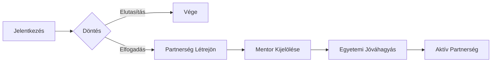

# 🏢 Cégadminisztrátor Útmutató

Ez az útmutató a cégadminisztrátorok számára készült, akik a teljes vállalati jelenlétet kezelik a rendszerben.

## 🏗️ Cégkezelés
- **Cégprofil**: Karbantarthatja a cég adatait (adószám, weboldal, elérhetőségek).
- **Helyszínek**: Létrehozhat és kezelhet különböző telephelyeket a céghez.

## 📢 Álláshirdetések (Pozíciók)
- **Új pozíció létrehozása**: Meghirdethet duális és nem duális álláshelyeket.
- **Kezelés**: Módosíthatja a meglévő hirdetéseket, beállíthat jelentkezési határidőket.

## 📩 Jelentkezések Értékelése
- **Beérkező jelentkezések**: Itt láthatja az összes hallgatót, aki jelentkezett a céghez. Megtekintheti a CV-ket és motivációs leveleket is.
- **Hallgatók böngészése**: Az elérhető hallgatók listájában kereshet, és az "Érdeklődés kifejezése" (`/:id/interest`) funkcióval közvetlenül jelezheti a hallgatónak, ha szimpatikus a profilja.
- **Folyamat és Mentorkezelés**:

- **Értékelés**: 
    - Elfogadhatja (`ACCEPTED`) vagy elutasíthatja (`REJECTED`) a jelentkezéseket.
    - **Fontos**: Amint elfogad egy jelentkezést, a rendszer automatikusan létrehoz egy **Duális Partnerkapcsolatot** a hallgatóval.

## 👥 Munkatársak Kezelése
- **Mentorok hozzárendelése**: A létrejött partnerségekhez Ön rendelheti hozzá a megfelelő céges mentort. Ez az első lépés a partnerség aktiválása felé.

## 📊 Statisztikák és Hírek
- Nyomon követheti a cég népszerűségét és a jelentkezők számát.
- Híreket kaphat az egyetemtől és a rendszertől.

> [!IMPORTANT]
> A partnerség csak akkor lép tovább az egyetemi jóváhagyásra, ha Ön kijelölte a mentort a rendszerben!
