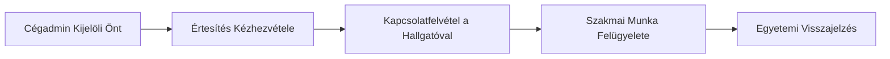

# 👨‍🏫 Mentor Útmutató

Üdvözöljük! Mentorként Ön kulcsszerepet játszik a duális képzésben részt vevő hallgatók szakmai fejlődésében.

## 🛠️ Feladatok és Lehetőségek

Ön a cég szakmai képviselője, aki közvetlenül támogatja a hallgatókat.

- **Pozíciók kezelése**: 
    - Megtekintheti a cég által meghirdetett pozíciókat.
    - Frissítheti a pozíciók adatait vagy inaktiválhatja azokat, ha betöltésre kerültek.
- **Jelentkezések megtekintése**: Láthatja a céghez érkező jelentkezéseket, így nyomon követheti az utánpótlást.
- **Mentorálás (Partnerségek)**: 
    - Ha Önt rendelték ki mentornak egy hallgató mellé, hozzáférhet a partnerség adataihoz.
    - Segítheti a hallgató adminisztrációját és szakmai munkáját a félév során.

## 🤝 Együttműködés
A rendszer segít, hogy Ön és a hallgató, valamint az egyetemi kapcsolattartó egy platformon tudjon együttműködni.

### Mentor Szerepköre

- **Értesítések**: Rögtön értesítést kap, ha új hallgatót rendelnek Önhöz, vagy ha fontos esemény történik a képzés során.
- **Hírek**: Hozzáférhet a céges és egyetemi hírekhez, hogy mindig naprakész legyen a szabályozásokkal kapcsolatban.

> [!NOTE]
> Mentor szerepkörrel Ön elsősorban a szakmai munkára és a hozzárendelt hallgatókra fókuszál. A cégszintű beállításokat a **Cégadminisztrátor** kezeli.
