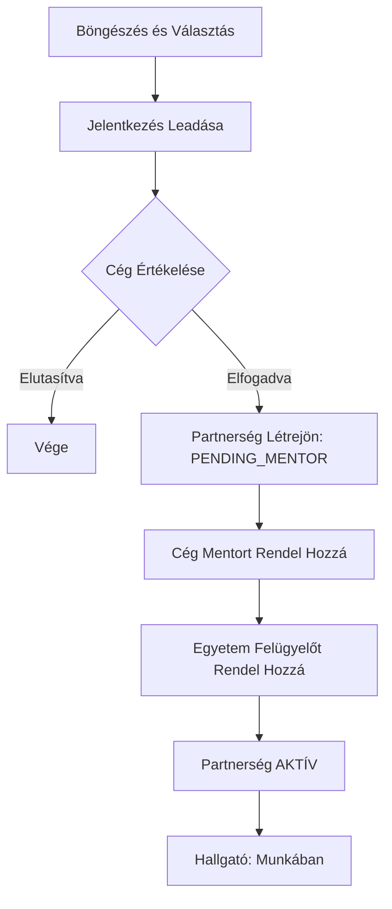

# 🎓 Hallgatói Útmutató

Üdvözöljük a Duális Képzés rendszerében! Ez az útmutató segít eligazodni a hallgatók számára elérhető funkciók között.

## 📱 Profil Kezelése
A profilod az alapja minden jelentkezésnek. Tartsd naprakészen!

- **Saját profil megtekintése**: Bármikor láthatod az adataidat a `/api/students/me` végponton (vagy a profil felületen).
- **Profil frissítése**: Ha változnak az adataid (telefonszám, lakcím), egyszerűen módosíthatod.
- **Egyetemi átállás**: Ha középiskolából egyetemre kerülsz, használd a "University Transition" funkciót a Neptun kódod és szakod rögzítéséhez.
- **Munkakeresési állapot**: Beállíthatod, hogy éppen keresel-e munkát (`isAvailableForWork`). Ha aktív vagy, a cégek láthatnak téged a keresőben!

## 💼 Jelentkezés Állásokra
Böngéssz a pozíciók között és találd meg a számodra megfelelőt.

- **Pozíciók böngészése**: Szűrj duális vagy nem duális állásokra, szakok vagy cégek szerint.
- **Jelentkezés leadása**: 
    - Csak egy gombnyomás, ha már van profilod.
    - **GDPR barát fájlfeltöltés**: Feltöltheted az önéletrajzodat (CV) és motivációs leveledet. Ezeket a szerver nem tárolja el, csak közvetlenül a cégnek küldi el emailben a biztonságod érdekében.
- **Jelentkezések kezelése**: Nyomon követheted a leadott jelentkezéseid állapotát (Leadva, Elfogadva, Elutasítva) és bármikor visszavonhatod őket.

## 🤝 Duális Partnerségek
Amint egy cég elfogadja a jelentkezésedet, elindul a partnerségi folyamat.

### A Jelentkezés Folyamata

- **Partnerségek megtekintése**: Látod az aktív és lezárt megállapodásaidat.
- **Folyamat**: 
    1. A cég elfogadja a jelentkezésed.
    2. A cég mentort rendel hozzád.
    3. Az egyetem felügyelőt rendel hozzád.
    4. Ha mindenki jóváhagyta, a partnerség **AKTÍV** lesz.
- **Automatikus állapot**: Amint aktív partnerséged lesz, a rendszer automatikusan "nem elérhető" állapotba tesz a munkakeresésnél.

## 🔔 Értesítések és Hírek
- **Hírek**: Mindig láthatod a legfrissebb egyetemi és céges híreket, amik kifejezetten neked szólnak.
- **Értesítések**: Rögtön tudsz róla, ha változik a jelentkezésed állapota vagy üzenetet kapsz.

> [!TIP]
> Mindig ellenőrizd a jelentkezési határidőket a pozícióknál, hogy ne maradj le semmiről!
