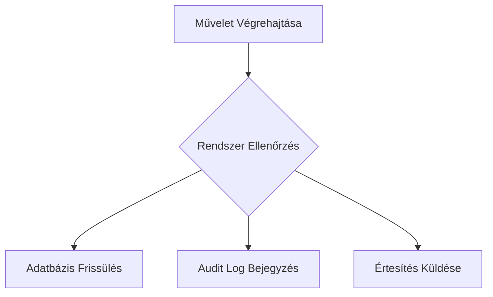

# ⚙️ Rendszergazda Útmutató

Üdvözöljük a rendszer irányítópultján! Rendszergazdaként Önnek teljes rálátása és kontrollja van a platform felett.

## 🛡️ Rendszerszintű Adminisztráció
- **Felhasználók kezelése**: Bármely felhasználó adatait módosíthatja, inaktiválhatja vagy törölheti őket.
- **Cégek kezelése**: 
    - Új cégek és cégadminok létrehozása (automatikusan jóváhagyott).
    - **Cég jóváhagyás**: A regisztrált cégek ellenőrzése a "Függőben lévő cégek" (`/pending`) listában.
    - Jóváhagyás (`/approve`) vagy elutasítás (`/reject`) kezelése.
    - Cégek aktiválása/deaktiválása és módosítása.
- **Audit Napló**: Bármikor visszakövetheti, hogy ki, mikor és milyen műveletet végzett a rendszerben.
- **Email beállítások**: Kezelheti a felhasználók email fogadási beállításait (`isEmailEnabled`).

## 📢 Közlemények és Hírek
- **Hírek létrehozása**: Megcélozhat konkrét szerepköröket (pl. csak hallgatók, csak egyetem) vagy küldhet üzenetet mindenkinek.
- **Folyamatkezelés és Audit**:

- **Kezelés**: Szerkesztheti, archiválhatja vagy törölheti a korábbi híreket.

## 📈 Statisztikák és Jelentések
Részletes statisztikai modul áll rendelkezésre a rendszer állapotának nyomon követésére:
- **Általános**: Felhasználók, cégek, pozíciók száma.
- **Jelentkezések**: Konverziós arányok, trendek.
- **Partnerségek**: Állapot szerinti megoszlás, féléves trendek.
- **Trendek**: Regisztrációk és aktivitások az elmúlt 6 hónapban.

## 🛠️ Karbantartás
- **Szakok (Majors) kezelése**: Teljes CRUD jogosultság a képzési szakok listájához.
- **Értesítések**: Rendszerszintű értesítések küldése.

> [!CAUTION]
> Rendszergazdaként végzett módosításai minden esetben naplózásra kerülnek az Audit Log-ban a nyomon követhetőség érdekében.
