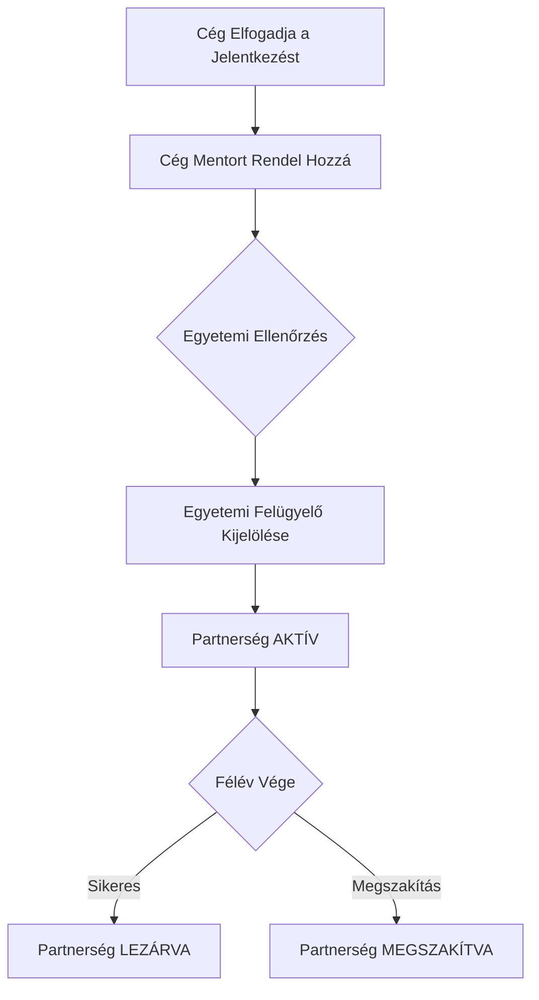

# 🏛️ Egyetemi Kapcsolattartó Útmutató

Ez az útmutató az egyetemi dolgozók számára készült, akik a duális képzés egyetemi oldalát és a szakmai felügyeletet kezelik.

## 🎓 Hallgatók Felügyelete
- **Hallgatók listázása**: Megtekintheti az összes regisztrált hallgatót és adataikat (Neptun kód, szak).
- **Elérhető hallgatók**: Láthatja, kik keresnek éppen aktívan duális helyet.

## 🤝 Partnerségek Jóváhagyása
Az Ön feladata a létrejött megállapodások véglegesítése és felügyelete.

### Jóváhagyási Folyamat

- **Új partnerségek**: Amikor egy cég mentort rendel egy hallgatóhoz, a partnerség Ön elé kerül jóváhagyásra.
- **Egyetemi felelős kijelölése**: Ön rendelheti hozzá a rendszerben az egyetemi felügyelőt (supervisor) a partnerséghez.
- **Aktiválás**: Ha kijelölte a felelőst, a partnerség **AKTÍV** állapotba kerül.
- **Lezárás/Megszakítás**: Önnek van jogosultsága befejezni vagy szükség esetén megszakítani a partnerségeket.

## 📜 Szakok (Majors) Kezelése
- Megtekintheti és karbantarthatja az elérhető szakok listáját, amelyre a hallgatók és a pozíciók hivatkoznak.

## 📊 Rálátás a Rendszerre
- Hozzáférhet a partnerségi és jelentkezési statisztikákhoz egyetemi szinten.
- Kommunikálhat a hallgatókkal és cégekkel a hírek felületen keresztül.

> [!IMPORTANT]
> A partnerség csak akkor válik élessé, ha az egyetem részéről is megtörtént a felelős kijelölése.
